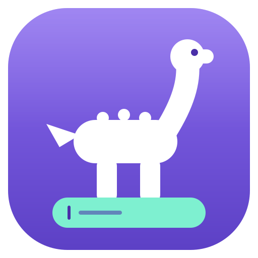

  

<h1 align="center">Barosaurus</h1>

<b>One bar. Every action.</b>

Barosaurus is a **command bar for Obsidian**: notes, commands, open tabs, headings, bookmarks, folders and tags come back in one grouped list — and every result has an action panel behind it. Find it and do it in the same field, without a second window.

## Set it up in ten seconds

Barosaurus ships **without a shortcut**, because a plugin should not quietly take one of your keys. It does nothing until you give it one:

1. Open **Settings → Hotkeys**
2. Search for **`Barosaurus: Open`** — that exact wording. Obsidian puts the plugin name in front, so the command is listed under *Barosaurus*, not under *Open*.
3. Assign **`⌘K`**

One thing before you take `⌘K`: Obsidian already uses it for *Insert link*. Move that one to `⌘⇧K` first and the two live together happily. The settings tab has a button that jumps straight to the hotkey list.

Would you rather not spend a shortcut at all? Switch on **double-tap shift** in the settings and press shift twice. There is a ribbon icon too, on by default, so the bar is reachable before you configure anything.

> Keys are written for macOS throughout. On Windows and Linux, `⌘` is `Ctrl`.

### `⌘K` opens it. `⌘K` acts.

One chord, two levels. Outside the bar it opens it. Inside the bar it opens the action panel for whatever row is highlighted — rename, move, bookmark, append to today's note. `⌘K`, a few letters, `⌘K`: from an empty screen to acting on a note, without touching the mouse.

## What you get

- **Everything in one field** — commands, notes, tabs, headings, bookmarks, folders and tags in a single grouped list. No modes to switch into, no prefix to memorise. Empty groups disappear along with their heading, so the list is never padded with nothing.
- **Act on any result, don't just find it** — `⌘K` opens its actions: rename, move, open to the right, copy a link, bookmark it, append it to today's note, delete it. The first action is the primary one, so `↵` usually does what you meant already.
- **Multi-step flows stay inside the bar** — *Move to* opens a folder picker, *Colour* opens a swatch picker, each with a breadcrumb pill showing where you came from and a query that survives going back a level.
- **It ranks by what you are doing** — select a sentence and everything that acts on a selection lifts, so typing `b` puts **Bold** first, ahead of every note in your vault that starts with b. Close the editor and the editor commands sink again. Not a filter, a nudge: the right thing rises, nothing useful disappears.
- **Every command, under a name you would actually type** — every command from every plugin is there automatically, and the ones you reach for get a proper name, an icon and plain-English synonyms on top. Obsidian calls it "Toggle bold"; you can type `b`, or `bold`, or `strong`.
- **It learns while you type** — what you use often and recently keeps its pull inside the ranking itself, not just as decoration on the empty list.
- **Radically clean** — one field and a list. Everything else lives on the keyboard, invisible until you use it.

## Why another bar

Obsidian has a command palette that finds commands, a quick switcher that finds files, and a search that finds text. Three shortcuts, three lists, and not one of them can actually *do* anything. Moving yesterday's note into a folder means three separate trips through three different windows.

The gap was never discovery. It is follow-through. The command palette finds "Move file to another folder" and then hands you to a second dialog to pick the folder. The quick switcher finds a note and then refuses to rename it. Everything in Obsidian is one keystroke away from being *found* and three windows away from being *done*. Barosaurus treats finding as the first half of the sentence and acting as the second: one bar, one flow, and the folder picker opens inside it with a breadcrumb behind you.

Barosaurus is the fifth plugin in the -osaurus family, next to [**Linkosaurus**](https://github.com/polygonhunter/linkosaurus), [**Scalosaurus**](https://github.com/polygonhunter/scalosaurus), [**Searchosaurus**](https://github.com/polygonhunter/searchosaurus), and [**Slashosaurus**](https://github.com/polygonhunter/slashosaurus). If something feels off or you have an idea, [open an issue on GitHub](https://github.com/polygonhunter/barosaurus/issues) — every one gets read.

## What it looks like

| You type | Barosaurus shows first |
|----------|------------------------|
| `b` *(with text selected)* | **Bold** — ahead of every note starting with b |
| `strong` | **Bold** again — entries answer to synonyms, not just their official name |
| `h2` | **Heading 2** — initials count, so you never spell it out |
| `>` | Every command in your vault, and nothing else |
| `@intro` | The **Introduction** heading in the note you are in |
| `:42` | Line 42 of the current note |
| `meeting` | The note, the tab that already has it open, the heading inside it, grouped |
| `move` *(on a result)* | A folder picker, with a breadcrumb pill showing where you came from |
| `Q3 report` *(no match)* | **Create "Q3 report"** — the empty state offers to make it |

## The keyboard layer

| Key | Does |
|-----|------|
| `↵` | Run the primary action |
| `⌘↵` / `⌘⌥↵` / `⌘⌥⇧↵` | Open in a new tab / to the right / in a new window |
| `⌘K` | Open the action panel for the highlighted result — the same key that opens the bar |
| `⌘1–9` | Pick a result directly — numbers appear while ⌘ is held |
| `⇥` | Complete, or dive into the highlighted result |
| `⌘P` | Pin or unpin (pinned entries lead the list) |
| `esc` | Back one level — only the last one closes the bar |
| `⌫` *(empty input)* | Same as esc, without moving your hand |
| `↑` | Recall recent queries (empty input) |
| `⌃N` / `⌃P` | Move the selection, for the Emacs-fingered |

## On your phone

The phone layout is not the desktop one squeezed down. The panel goes flat and full width, the glass and the blur come off, rows grow to a proper touch size, and the preview pane is not merely hidden but never built — a phone has the least to spare for reading files and rendering Markdown it cannot show you. The result list keeps clear of the home indicator. Tablets keep the full desktop layout, pill and all. The ribbon icon lands in the side menu, so the bar is reachable without configuring anything.

## Privacy

Barosaurus works offline and sends nothing anywhere. There is no telemetry, no analytics, and nothing from your vault ever leaves your device.

There is exactly one outbound request, and only if you opt in: switching on OCR downloads the text-recognition models once, verified against a pinned checksum. After that, indexing, search and recognition all run locally.

The only other things that ever open a connection are the help entries — **Report a bug or get in touch** and **Open an issue on GitHub**, in the bar and as the **Get in touch** button in the settings tab. They open your browser when you pick one, and never otherwise.

## Roadmap

- [An inline calculator](https://github.com/polygonhunter/barosaurus/issues/1) — type an expression, insert the answer
- [Multi-select with bulk actions](https://github.com/polygonhunter/barosaurus/issues/2) — mark several results, move them all at once
- Search by frontmatter property
- Canvas nodes as their own result type

## Contributing

See [CONTRIBUTING.md](CONTRIBUTING.md). The short version: `src/core/` stays pure and tested, the UI stays radically clean.

---

MIT © [polygonhunter](https://github.com/polygonhunter)
